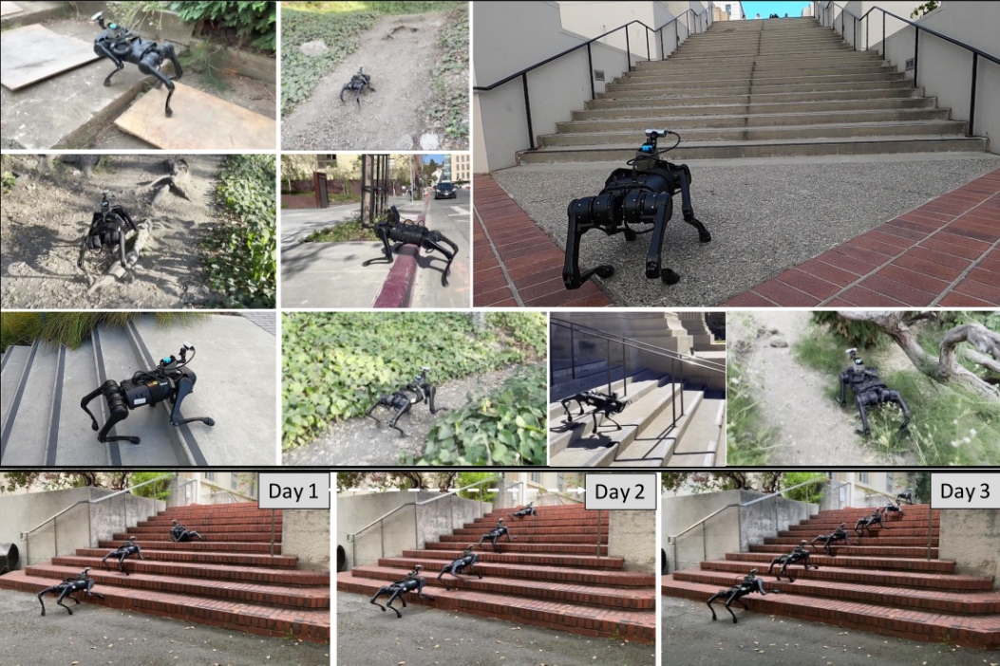

# Continual Learning for Locomotion with Cross-Modal Supervision

This repo contains the code associated with the paper Learning Visual Locomotion with Cross-Modal Supervision.
For more information, please check the [project webpage](https://antonilo.github.io/vision_locomotion/).




#### Paper, Video, and Datasets

If you use this code in an academic context, please cite the following publication:

Paper: [Learning Visual Locomotion With Cross-Modal Supervision](https://antonilo.github.io/vision_locomotion/pdf/manuscript.pdf)

Video (Narrated): [YouTube](https://youtu.be/d7I34YIdMdk)

```
  @InProceedings{loquercio2022learn,
   author={Loquercio, Antonio and Kumar, and Malik, Jitendra},
   title={{Learning Visual Locomotion with Cross-Modal Supervision}},
   booktitle={International Conference on Robotics and Automation},
   year={2023}
  }
```

## Usage

This code is divided in two parts. The first is for training and running the vision models, which generally runs on a workstation. The second instead runs on the legged robot (Unitree A1). You can use this code also for the Go1 robot, but you might have to change some part of the code to adapt to the new SDK. Note that we don't provide support for problems related to the robot.

### Workspace Installation (On a Desktop)
The code was tested with Ubuntu 20.04 and ROS Noetic. Different OS and ROS versions are possible but not supported. In particular, we don't support virtual machines or docker. Use the following commands to create a new catkin workspace and a virtual environment with all the required dependencies. Note that a slightly different version of this will be need to be installed on the Robot.

```bash
sudo apt-get install python3-catkin-tools
cd
export ROS_VERSION=noetic
mkdir cms_ws
cd cms_ws
export CATKIN_WS=./catkin_cms
mkdir -p $CATKIN_WS/src
cd $CATKIN_WS
catkin init
catkin config --extend /opt/ros/$ROS_VERSION
catkin config --merge-devel
catkin config --cmake-args -DCMAKE_BUILD_TYPE=Release -DCMAKE_CXX_FLAGS=-fdiagnostics-color
cd src

conda create --name cms python=3.8
conda activate cms
conda install pytorch torchvision torchaudio pytorch-cuda=11.7 -c pytorch -c nvidia
pip install rospkg opencv-python vcstool empy scikit-learn matplotlib pandas wandb plotly
```


You should now export Torch_DIR to be where libtorch is. To find the folder use the following command:
`find . -type f| grep libtorch`, should be a sitepackage under python 3.8. An example of the command you need to run `export Torch_DIR=/home/antonio/aa/lib/python3.8/site-packages/torch/`. Be sure to adapt it to your path. Now you're ready to build.

```
cd $CATKIN_WS/src
git clone https://github.com/antonilo/vision_locomotion
mv vision_locomotion agile_locomotion
vcs-import < agile_locomotion/dependencies.yaml

catkin build
source CATKIN_WS/devel/setup.bash

```

#### Train a vision predictor

We provide a pre-trained vision module, but the beauty of cross-modal supervision is that you can continuously train a model on the data that your robot collects. We added a small dummy dataset in the "data" folder. However, you should use the data collected from your robot (see [this section](https://github.com/antonilo/vision_locomotion#collecting-data-with-the-blind-policy) for seeing how to do so) for training. You can either start from scratch or finetune the model we provide.

Please edit the file [train\_config.yaml](./visual_locomotion/learning/config/train_config.yaml) for adapting configs to your case. Configs name should be self-explanatory.

```bash
cd cms_ws
source catkin_cms/devel/setup.bash
conda activate cms
cd catkin_cms/src/cms/visual_locomotion/learning
python train.py --config_file=config/train_config.yaml
```


### Workspace installation (Robot)

We now need to install the catkin workspace on the robot. Note that this is a standalone part, and you can run this code without any installation on your desktop or running any vision predictor. However, in this case, the robot will be completely blind. This code was tested on an A1 robot with an Intel Upboard as compute. If you have a different version, you might need some adaptation to the code.

Use the following commands to create a new catkin workspace and a virtual environment with all the required dependencies. ROS should already be installed on the robot. If not, install it first using [this guide](http://wiki.ros.org/noetic/Installation/Ubuntu). You should install the ros-base version of it, since you only need very limited functionalities.

```bash
sudo apt-get install python3-catkin-tools
cd
export ROS_VERSION=noetic 
mkdir cms_ws
cd cms_ws
export CATKIN_WS=./catkin_cms
mkdir -p $CATKIN_WS/src
cd $CATKIN_WS
catkin init
catkin config --extend /opt/ros/$ROS_VERSION
catkin config --merge-devel
catkin config --cmake-args -DCMAKE_BUILD_TYPE=Release -DCMAKE_CXX_FLAGS=-fdiagnostics-color
cd src

# Consider to global or virtual environment installation if you encouter problems with conda installation. If you don't have a GPU, consider installing only the CPU version. Finally, ofter pytorch is already installed, so you can skip its installation.

conda create --name cms python=3.8
conda activate cms
conda install pytorch torchvision torchaudio pytorch-cuda=11.7 -c pytorch -c nvidia
pip install rospkg opencv-python vcstool empy
```

You should now export Torch_DIR to be where libtorch is. To find the folder use the following command:
`find . -type f| grep libtorch`, should be a sitepackage under python 3.8. An example of the command you need to run `export Torch_DIR=/home/antonio/aa/lib/python3.8/site-packages/torch/`. Be sure to adapt it to your path. Now you're ready to build.

```
cd $CATKIN_WS/src
git clone https://github.com/antonilo/vision_locomotion
mv vision_locomotion agile_locomotion
vcs-import < agile_locomotion/dependencies.yaml

catkin build
source CATKIN_WS/devel/setup.bash

# adding the following to your bash file to automatically source the workspace (optional)

echo 'source /home/unitree/cms_ws/catkin_cms/devel/setup.sh' >> ~/.bashrc

```

Since the Unitree SDK requires memory locking and high-priority process, which is not usually granted without sudo, add the following lines to /etc/security/limits.conf (reboot the robot afterwards):
```
unitree soft memlock unlimited
unitree hard memlock unlimited
unitree soft nice eip
unitree hard nice eip 
unitree soft rtprio 99
unitree hard rtprio 99
```


#### Running the (blind) policy

Assuming everything worked, you can now launch a blind policy and control the robot with the joystick. You can control the forward speed (only positive) and angular speed (yaw rate) with the left controller. Remember to press L2+B on the robot to put it in sport mode before starting.

Note that this policy can go up and downstairs, but it is blind, so be very careful! It works upstairs for stairs of up 19cm of stairs height, downstairs up to 13cm of step height. When you try a staircase for the first time, hold the robot to be sure it can do it.

To start the policy, connect to the robot and run the following commands in different terminals:

```
# On terminal 1, run the following to start the policy
roslaunch agile_locomotion cms_ros.launch

# On terminal 2, run the following to start the robot
rostopic pub /agile_locomotion/walk std_msgs/Empty "{}" -1
```

#### Collecting data with the blind policy

To collect data, you need to install the realsense package in your workspace. Since this is a ROS1 package, I installed [this version](https://github.com/IntelRealSense/realsense-ros/tree/2.3.0), but feel free to upgrade. You can use [this mount](media/mount.stl) for mounting the realsense on the robot camera. You might want to tune the camera parameters to your case (for example adding depth images) editing [this file](./controller/launch/d435_only.launch). 

To start the policy, connect to the robot and run the following commands in different terminals:

```
# On terminal 1, run the following to start the blind policy
roslaunch agile_locomotion cms_ros.launch

# On terminal 2, run the realsense camera
roslaunch agile_locomotion d435_only.launch

# On terminal 3, run the following to start the robot
rostopic pub /agile_locomotion/walk std_msgs/Empty "{}" -1
```

Now, while walking, the robot will save multi-modal data in [the data folder](./data). Get the data from the robot to your workstation and use the commands from the previous sections to train a visual predictor using your model.


#### Walk with Vision

The vision model runs on a separate compute with GPU which is connected through WIFI or Ethernet to the robot. The connection happens via ROS. You can follow [this tutorial](http://wiki.ros.org/ROS/Tutorials/MultipleMachines) to connect the robot to the workstation. In short, the thing to do is adding these lines on the bashrc of your external compute.

```
my_ip=$(hostname -i | sed 's/\([0-9]\{1,3\}\.[0-9]\{1,3\}\.[0-9]\{1,3\}\.[0-9]\{1,3\}\).*/\1/g')
#my_ip=128.32.175.236 # lab
#my_ip=10.0.0.233 # home

#roscore_ip=$my_ip
roscore_ip=192.168.123.161 #wifi intelup is running the roscore
#roscore_ip=192.168.123.12 #wifi rasperry

export ROS_IP=$my_ip
export ROS_HOSTNAME=$my_ip
export ROS_MASTER_URI=http://${roscore_ip}:11311

# allow ssh to launch remote nodes
export ROSLAUNCH_SSH_UNKNOWN=1

## enable connection (necessary if your firewall blocks connection). Note that this can be dangerous :)
alias allow_connections='sudo systemctl stop firewalld.service'
```

Assuming the connection works, you can run the following command on the external compute to start inference. Please edit the file [test\_config.yaml](./visual_locomotion/learning/config/test_config.yaml) for adapting configs to your case. There is a default network you can use, but you should consider finetuning on your own real world data for optimal performance!


```bash
cd cms_ws
source catkin_cms/devel/setup.bash
conda activate cms
cd catkin_cms/src/cms/visual_locomotion/learning/nodes
python tester_node.py --config_file ../config/test_config.yaml
```

Now that the vision predictor is ready, start the robot and walk with it using the following commands!

```
# On terminal 1, run the following to start the blind policy
roslaunch agile_locomotion cms_ros.launch

# On terminal 2, run the realsense camera
roslaunch realsense2_camera rs_camera.launch

# On terminal 3, run the following to start the robot
rostopic pub /agile_locomotion/walk std_msgs/Empty "{}" -1
```

## Policy Training

In case you would like to train different control policies using reinforcement learning please follow the instructions from [this repository](https://github.com/antonilo/rl_locomotion). 

## Trouble-shooting 
If you encouter the following error "Lock memory failed", try two things. 
First, before launching the code, run the **su** command to enter in superuser mode and then launch again the code.
If this does not work check the sdk version that you're using. This project uses [version 3.3.1](https://github.com/unitreerobotics/unitree_legged_sdk/releases/tag/v3.3.1). If you are using another sdk, put the lib files in [this folder](https://github.com/antonilo/vision_locomotion/tree/master/controller/lib). Make sure to be able to launch examples with your sdk before using the code in this repository.
Some users reported that when using an older version of the SDK (version 3.2), you need to comment out the ``` InitEnvironment()``` function from the code. 

## Acknowledgements

We would like to thank [Raven Huang](https://scholar.google.com/citations?user=N_KDBGcAAAAJ&hl=en) for the help with the camera mount. In addition, we would like to thank [Zipeng Fu](https://zipengfu.github.io/) for the helpful discussion on training a locomotion policy. Finally, we would like to thank [Noemi Aepli](https://noe-eva.github.io/) for the help with recording multimedia material during the experiments.
